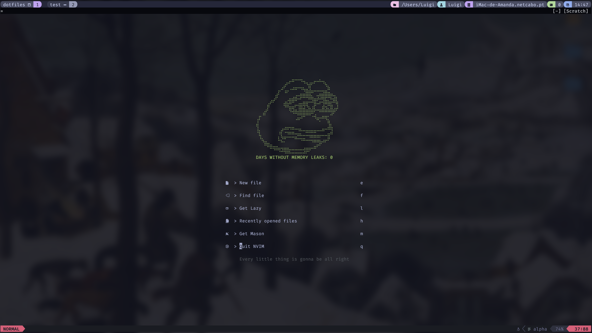
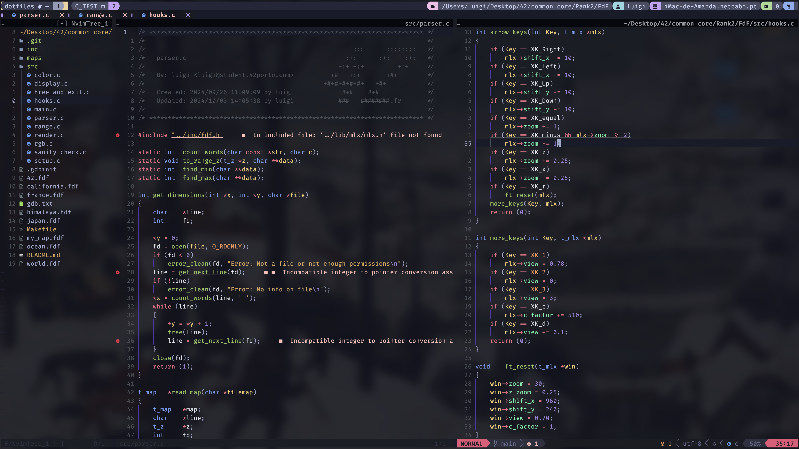

# My Setup

<p align="center">
	
    
</p>

# How to config

To make the config for my setup we're going to need some tools: Homebrew (to manage the apps), Kitty (the terminal that we're going to work) and Neovim(the main text editor).

If you want to do manually, follow Part 1 and 2. Otherwise, you can just run the script in Part 3

# Index

<p>
    <ul>
    <li> <a href="#part-1-tools">Part 1. Tools</a></li>
    <li><a href="#part-2-setup-the-configurations">Part 2. Setup the configurations </a></li>
    <li><a href="#part-3-script">Part 3. Script</a></li>
    </ul>
</p>

___


Let's start Installing **Homebrew**

# Part 1. Tools

## Homebrew

Open your terminal and install Homebrew
### With sudo permissions
```bash
git clone https://github.com/Homebrew/brew homebrew
```
and then run this:
```bash
eval "$(homebrew/bin/brew shellenv)"
brew update --force --quiet
chmod -R go-w "$(brew --prefix)/share/zsh"
```

Done! Should work perfectly right now. If this do not work, follow the manual: https://brew.sh

### Without sudo permissions
If you don't have sudo permissions, don't you worry. Try this:

```bash
mkdir -p ~/.local/Homebrew &&
curl -L https://github.com/Homebrew/brew/tarball/master 
|tar xz --strip 1 -C ~/.local/Homebrew
```
after this commands, use:

```bash
mkdir -p ~/.local/bin &&
ln -s ~/.local/Homebrew/bin/brew ~/.local/bin
https://nelsonaloysio.medium.com/installing-homebrew-without-sudo-5e708a929522
```
>[!NOTE]
>If you're at 42 school, instead of using ~/.local use ~/.sgoinfre

Done! Should work perfectly right now. If this do not work, follow the manual: https://nelsonaloysio.medium.com/installing-homebrew-without-sudo-5e708a929522

## Kitty
After installing Homebrew, let's install our terminal emulator: Kitty.

To do so, let's use this command:

```bash
curl -L https://sw.kovidgoyal.net/kitty/installer.sh | sh /dev/stdin
```
>[!IMPORTANT]
>You should have `curl`. If you do not have it, try installing with `brew install curl`

Done! Should work perfectly right now. If this do not work, follow the manual: https://sw.kovidgoyal.net/kitty/binary/

## Neovim
It is supposed that neovim is already installed in this point, if not, run this simple command

```bash
brew install neovim
```

Once this is done, it's time to `git clone` my config and setup to our tools.

# Part 2. Setup the configurations

## Clone my dotfiles
```bash
git clone https://github.com/lude-bri/.dotfiles.git  ~/.dotfiles
```
## Creating symlinks

### Setup Bash
```bash
ln -s ~/.dotfiles/.bashrc ~/.bashrc
ln -s ~/.dotfiles/.bash_aliases ~/.bash_aliases
```
### Setup zsh
```bash
ln -s ~/.dotfiles/.zshenv ~/.zshenv
ln -s ~/.dotfiles/.zshrc ~/.zshrc
```
### Install starship prompt
```bash
curl -sS https://starship.rs/install.sh | sh
ln -s ~/.dotfiles/starship.toml ~/.config/starship.toml
```
### Setup vim
```bash
ln -s ~/.dotfiles/.vimrc ~/.vimrc
```

### Install vim-plug
```bash
# Install vim-plug
curl -fLo ~/.vim/autoload/plug.vim --create-dirs \
https://raw.githubusercontent.com/junegunn/vim-plug/master/plug.vim

mkdir -p ~/.vim ~/.vim/autoload ~/.vim/backup ~/.vim/colors ~/.vim/plugged
```

### Setup neovim
```bash
ln -s ~/.dotfiles/nvim/ ~/.config/
```

### Install TMUX
It is supposed that tmux is already installed, if not run this:

```bash
brew install tmux
```

### Setup tmux
```bash
ln -s ~/.dotfiles/.tmux.conf.local ~/.tmux.conf.local
```

### Install oh-my-tmux
```bash
cd
git clone https://github.com/gpakosz/.tmux.git
ln -s -f .tmux/.tmux.conf
```

### Install Tmux Plugin Manager
```bash
git clone https://github.com/tmux-plugins/tpm ~/.tmux/plugins/tpm
```

and put this at the bottom of `~/.tmux.config`
```bash
# List of plugins
set -g @plugin 'tmux-plugins/tpm'
set -g @plugin 'tmux-plugins/tmux-sensible'

# Other examples:
# set -g @plugin 'github_username/plugin_name'
# set -g @plugin 'github_username/plugin_name#branch'
# set -g @plugin 'git@github.com:user/plugin'
# set -g @plugin 'git@bitbucket.com:user/plugin'

# Initialize TMUX plugin manager (keep this line at the very bottom of tmux.conf)
run '~/.tmux/plugins/tpm/tpm'
```
Reload TMUX environment so TPM is sourced
```bash
# type this in terminal if tmux is already running
tmux source ~/.tmux.conf
```

### LAZYVIM
Lazyvim is probably already installed, if not, run this:

```bash
git clone https://github.com/LazyVim/starter ~/.config/nvim
rm -rf ~/.config/nvim/.git
```

### Last things: Nerdfont
Now let's just adjust little things to start rocking, installing some plugins to our terminal

```bash
brew install nerdfetch
```
to use the nerdfont that I am using run this command:

```bash
brew install --cask font-fira-code-nerd-font
```

Hopefully that works! Otherwise, try installing manually right here: https://www.nerdfonts.com

And that's it!!

# Part 3. Script

## How to use it
First, get this repository

```bash
git clone https://github.com/lude-bri/.dotfiles.git  ~/.dotfiles
```

Then, inside of the directory `.dotfiles` make the script exectuable

```bash
chmod +x setup.sh
```

And run the script

```bash
./setup.sh
```


